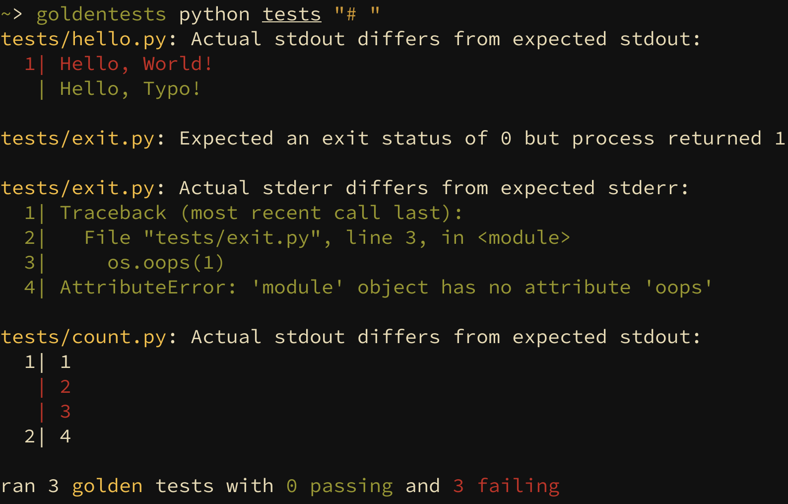

## Golden Tests

[](https://crates.io/crates/goldentests)
[](https://docs.rs/goldentests)

Golden tests is a golden file testing library configured so that tests
can be created and edited from the test files alone without ever touching
the rust source code of the test.

### Why golden tests?

Golden tests allow you to specify the output of
some command within a file and automatically ensure
that that output doesn't change. If it does, goldentests
will show an error-diff showing the expected and actual
output. This way, whenever the output of something changes
a human can see the change and decide if it should be kept
or is a bug and should be reverted.

### What are golden tests useful for?

Golden tests are especially useful for applications that
take a file as input and produce output of some kind. For
example: compilers and config-parsers (well, parsers in general)
are two such applications that can benefit form automated golden
tests. In the case of a config parser, you would be able to
provide many config examples as tests and ensure that your
parser was able to read the files with the expected stdout/stderr
output and exit code.



### Getting Started

To get started plop this into your `Cargo.toml`:
```toml
goldentests = "0.3"
```

And create an integration test in `tests/goldentests.rs`. The specific name
doesn't matter as long as the test can be picked up by cargo. A typical usage
looks like this:

```rust
use goldentests::{ TestConfig, TestResult };

#[test]
fn run_golden_tests() -> TestResult<()> {
    let config = TestConfig::new("target/debug/my-binary", "my-test-path", "// ");
    config.run_tests()
}
```

This will tell goldentests to find all files recursively in `my-test-path` and
run `target/debug/my-binary` to use the files in some way to produce the expected
output.  For example, if we're testing a compiler for a C-like language a test
file for us may look like this:

```c
puts("Hello, World!");

// args: --run
// expected stdout:
// Hello, World!
```

This will run the command `target/debug/my-binary --run my-test-path/example.c` and will issue
an error if the output of the command is not "Hello, World!".

Note that there are test keywords `args:` and `expected stdout:` embedded in the comments.
This is what the `"// "` parameter was in the rust example. You can change this parameter
to change the prefix that goldentests looks for when parsing a file. For most languages,
this should be a comment of some kind. E.g. if we were testing haskell, we would use `-- `
as the test-line prefix.

### Advanced Usage

Here is the full set of keywords goldentests looks for in the file:

- `args: <single-line-string>`: Anything after this keyword will be used as the command-line arguments for the
  program that was specified when creating the `TestConfig`. Each argument is separated by spaces.
- `expected stdout: <multi-line-string>`: This keyword will continue reading characters, appending
  them to the expected stdout output until it reaches a line that does not start with the test prefix
  ("// " in the example above). If the stdout when running the program differs from the string given here,
  an appropriate error will be issued with a given diff. Defaults to `""`.
- `expected stderr: <multi-line-string>`: The same as `expected stdout:` but for the `stdout` stream. Also
  defaults to `""`.
- `expected exit status: <i32>`: If specified, goldentests will issue an error if the exit status differs
  to what is expected. Defaults to `None` (exit status is ignored by default).


You can even configure the specific keywords used if you want. For any further information,
check out goldentest's documentation [here](https://docs.rs/goldentests).
